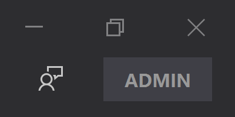

# NanaGet Sponsor Edition

NanaGet provides a $99.99 USD Sponsor Edition addon to the Microsoft Store to
attract more sponsors and contributors.

It's free for NanaGet source code repository contributors.

## Feature

The only difference for NanaGet Sponsor Edition is showing "Appreciate your
sponsorship" button instead of "Sponsor NanaGet" button in the next
stable version of NanaGet's toolbar like the Visual Studio administrator mode.

## Purpose

We hope every NanaGet user is happier than before. Here is why we offer a
sponsored version:

- Most users: We are happy with using a $99.99 product freely without feature 
  differences.
- Contributors: We want to show "Appreciate your sponsorship" button to
  others. It's free because we are the contributors. Contribute it if you want
  to get that free.
- Sponsors: You can show "Appreciate your sponsorship" button to others
  because sponsors deserve that.
- The author of NanaGet, Kenji Mouri: Finally, NanaGet has a price. Nobody will
  think this is a worthless product. Efforts from contributors and I should have
  value even NanaGet is a fully free and open source project.

## Notes for NanaGet source code repository contributors

If you are the contributor of NanaGet source code repository, please contact
with Kenji.Mouri@outlook.com for more information.

Note: If you are the contributor of Project Mile projects which is used in
NanaGet, you are eligibled too. I think I have sent e-mails or QQ message 
to all eligible Project Mile contributors.
