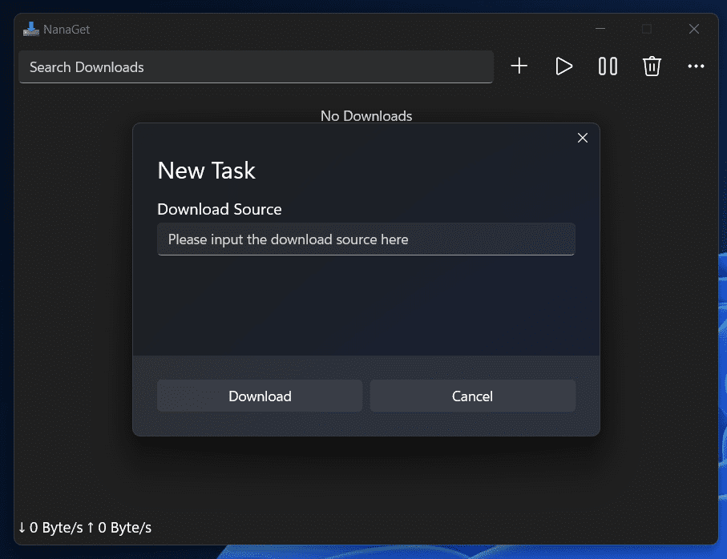

#  NanaGet

NanaGet is a lightweight file transfer utility based on aria2 and XAML Islands.

**All kinds of contributions will be appreciated. All suggestions, pull 
requests, and issues are welcome.**

## Features

- Currently based on Mile.Aria2 (https://github.com/ProjectMile/Mile.Aria2), 
  the customized version of aria2 (https://github.com/aria2/aria2#features)
  which is specialized for MSVC toolchain. 
- Multi-language Support: English, German, Japanese, Traditional Chinese and 
  Simplified Chinese.
- Packaging with MSIX for modern deployment experience.
- Modernize the UI with XAML Islands with the Windows 11 control style, dark
  and light mode support.
- Full High DPI and partial Accessibility support.

## System Requirements

- Supported OS: Windows 10 Version 2004 (Build 19041) or later
- Supported Platforms: x86 (64-bit) and ARM (64-bit)

## Download and Installation

Here are some available installation methods for NanaGet.

### Microsoft Store

This is the recommended way to install NanaGet.

Search and install `NanaGet` in Windows Store for stable release, and `NanaGet
Preview` for preview release.

Also, you can also click the Microsoft Store link you needed.

- [NanaGet](https://www.microsoft.com/store/apps/9PD5F2D90LS5)

### MSIX Package

You also can download the MSIX Package in 
[GitHub Releases](https://github.com/M2Team/NanaGet/releases).

After you have downloaded the MSIX Package, you can double click to install it,
or you can execute the following command in the Command Prompt which is run as 
the Administrator.

> PowerShell -NoLogo -NoProfile -NonInteractive -InputFormat None -ExecutionPolicy Bypass Add-AppxPackage -DeferRegistrationWhenPackagesAreInUse -ForceUpdateFromAnyVersion -Path `The path of the MSIX package`

P.S. All needed dependencies are included in the MSIX Package of NanaGet 
because we known that it's very difficult for users who do not have access to 
the store to get our dependency packages, and we want to be robust and 
deployable everywhere.

## Known issues

N/A.

## Development Roadmap

- 1.x Series (T.B.D.)
  - [ ] Remote aria2 instance support.
  - [ ] Providing HASH value for downloaded files.
  - [ ] Get download uri from QR code and texts in images.
  - [ ] Add removing file support when cancelling tasks for local instance.
  - [ ] Add open task's folder support with File Explorer for local instance.
  - [ ] Add custom download folder support for local instance.
  - [ ] Add speed limit and other useful setting items.
  - [ ] Implement uri protocol handlers for making people available to make 
        browser extensions.
  - [ ] Continue tweaking the task list user interface.
- 2.x Series (T.B.D.)
  - [ ] Try to create Assassin transfer engine.

## Documents

- [License](License.md)
- [Relevant People](Documents/People.md)
- [Privacy Policy](Documents/Privacy.md)
- [Code of Conduct](CODE_OF_CONDUCT.md)
- [Contributing Guide](CONTRIBUTING.md)
- [Release Notes](Documents/ReleaseNotes.md)
- [Versioning](Documents/Versioning.md)
- [My Digital Life Forums](https://forums.mydigitallife.net/threads/76241)
